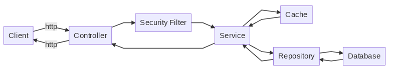
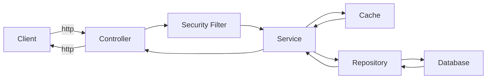
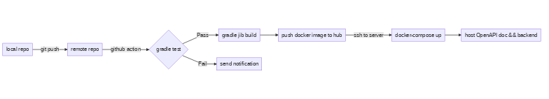
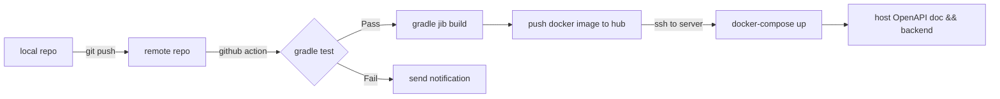

# E-commerce System Backend

**implement with Spring Framework**

---

## Imported Packages

- Spring Boot
- Spring Security
- Spring Cache
- Spring Data JPA
- PostgreSQL Driver
- Jackson (Serialization and Deserialization)
- Lettuce (Redis connection driver)
- OpenAPI (generate OpenAPI Doc)
- problem-spring-web (beautify http error output)
- ModelMapper (Convert between DTO and entity)
- Embedded H2 Database (test)
- Embedded Redis (test)
- jib (compile docker image)

## Basic Flow Structure

<!-- generated by mermaid compile action - START -->

  
Mermaid markup

<!-- generated by mermaid compile action - END -->

## Development Workflow

<!-- generated by mermaid compile action - START -->

  
Mermaid markup

<!-- generated by mermaid compile action - END -->

## Some Development Tips

- About Getter and Setter, if the object is mutable, always create a new instance. For example, `Date` and `byte[]`.
- Use `BigDecimal` when handling price value.
- Use `ModelMapper` for converting `DTO` and `Entity`. Make sure the names of properties are exactly same.
- Cache has not been tested!! [TODO]
- `User.email` is mapped to `username`
- Test DB is totally new, which means you need to add date first then do your test process.
- Test DB will be truncated after program terminate.
- Test DB and Redis may be switched to docker containers.
